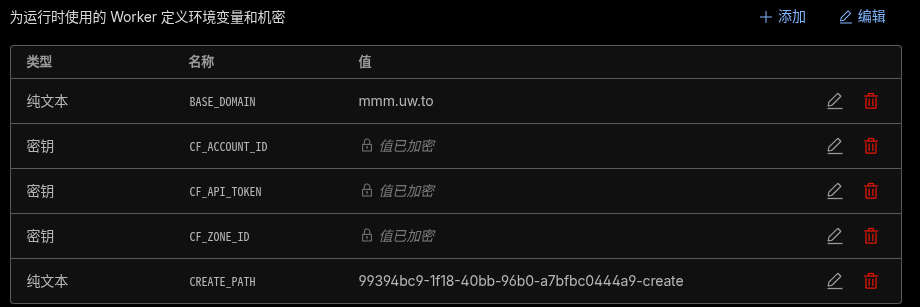
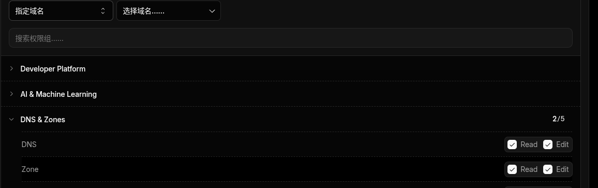

# MNC 安装脚本

一套基于 sing-box、mihomo 和 cloudflared 的一键安装脚本，旨在快速部署多种代理协议。

## 主要脚本说明

- **`mnc-install.sh`**：一键安装 mihomo，并配置 `hysteria2`， `vless-reality`， `anytls`， `vless-ws` , `tuic-v5`, `mieru`, `trusrtunnel` ,默认使用443和2053。
- 支持使用自定义证书或内置默认证书，创建订阅链接。功能全面，开启ech。
- **`sing-box-install.sh`**：一键安装 sing-box，并自动配置 `reality` 和 `hysteria2` 服务，配置要求低。可在64mb内存的设备上尝试。
- **`cloudflared-install.sh`**：适用于没有入站端口（如被防火墙拦截或无公网 IP）的vps，通过 Cloudflare Tunnel 建立隧道。

## 使用说明

### 1. 一键安装 mihomo (推荐)
安装mihomo并配置 `hysteria2`， `vless-reality`， `anytls`， `vless-ws` , `tuic-v5`, `mieru`, `trusrtunnel`。
```bash
curl -fsSL https://raw.githubusercontent.com/niylin/mnc-install/master/mnc-install.sh | bash
```
备用链接：
```bash
curl -fsSL https://link.wdqgn.eu.org/nopasswd/mnc-install.sh | bash
```

### 2. 一键安装 sing-box
配置 `hysteria2` 和 `reality`。
```bash
curl -fsSL https://raw.githubusercontent.com/niylin/mnc-install/master/sing-box-install.sh | bash
```
备用链接：
```bash
curl -fsSL https://link.wdqgn.eu.org/nopasswd/sing-box-install.sh | bash
```

### 3. 一键安装 cloudflared (隧道模式)
适用于无入站环境。
```bash
curl -fsSL https://raw.githubusercontent.com/niylin/mnc-install/master/cloudflared-install.sh | bash
```
备用链接：
```bash
curl -fsSL https://link.wdqgn.eu.org/nopasswd/cloudflared-install.sh | bash
```


### worker，用于tunnel和dns分发API，可部署在Cloudflare Workers
- tunnel.js  
- BASE_DOMAIN:用于分发的域，  CF_ACCOUNT_ID:账户标识ID，  CF_ZONE_ID:用于分发域的ZONE_ID 。
- CF_API_TOKEN:拥有管理隧道和创建特定域dns的权限的令牌，一般通过cloudflared通过 cloudflared login 创建，然后找到该令牌，点击轮转即可获得通用令牌  。
- CREATE_PATH:自定义PATH，更改即可使旧链接失效。
- 请求方式，访问链接即可 https://API_DOMAIN/YOUR_CREATE_PATH
  

- dns.js
- API_TOKEN:创建特定域dns的权限的令牌，控制台手动生成。
- ZONE_ID:用于分发域的ZONE_ID 。
- CREATE_PATH:自定义PATH，更改即可使旧链接失效。
- 请求方式  domain_name;ip_address需要解析的域名和IP地址。
```
CDN_CHICE=  # 可选 开启 不开启 CDN. true false
curl -s -X POST https://API_DOMAIN/YOUR_CREATE_PATH \
        -H "Content-Type: application/json" \
        -d "{\"domain\":\"$Certificate_name\",\"ip\":\"$ip_address\",\"enable_cdn\":$CDN_CHICE}"
```

  
